# Fix review screenshots

Captured from the combined reviewed changes on September 23–24, 2026 at the canonical HTTPS origin. Desktop 1440×900, mobile 390×844; narrow screenshots 320×740. Schemer captures use an isolated API fixture with the shipped UI. Existing model checks did not save changes.

PRs: [#56 account](https://github.com/LandMineDevelopment/schemii/pull/56), [#57 model](https://github.com/LandMineDevelopment/schemii/pull/57), [#58 shared UI](https://github.com/LandMineDevelopment/schemii/pull/58).

The initial model view preserves readable scale around the starting source; explicit Fit remains an overview. Older empty Explore defaults and generated positions no longer count as user edits. Actual edits still become dirty.

## desktop connection

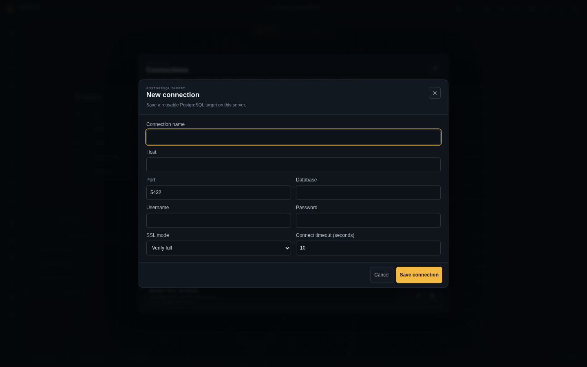

## desktop new table

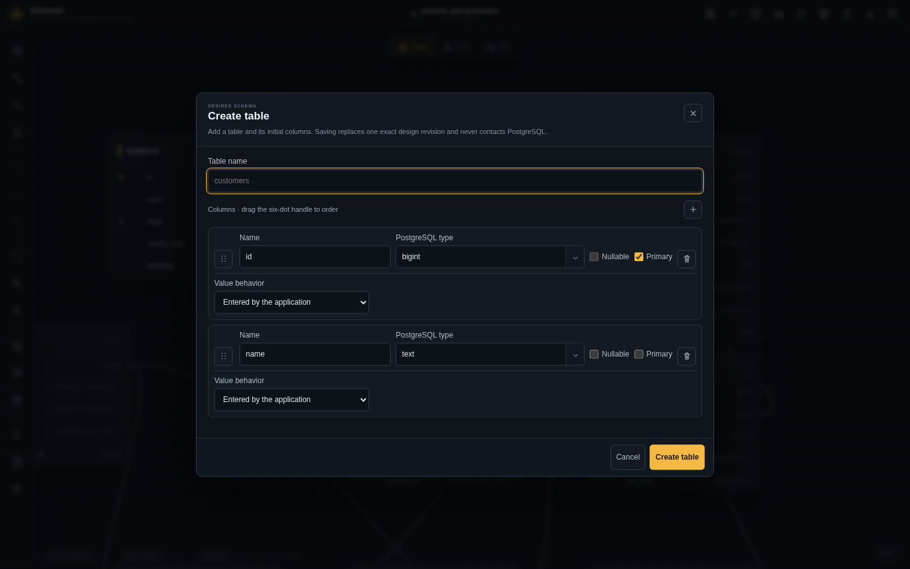

## desktop ordinary view

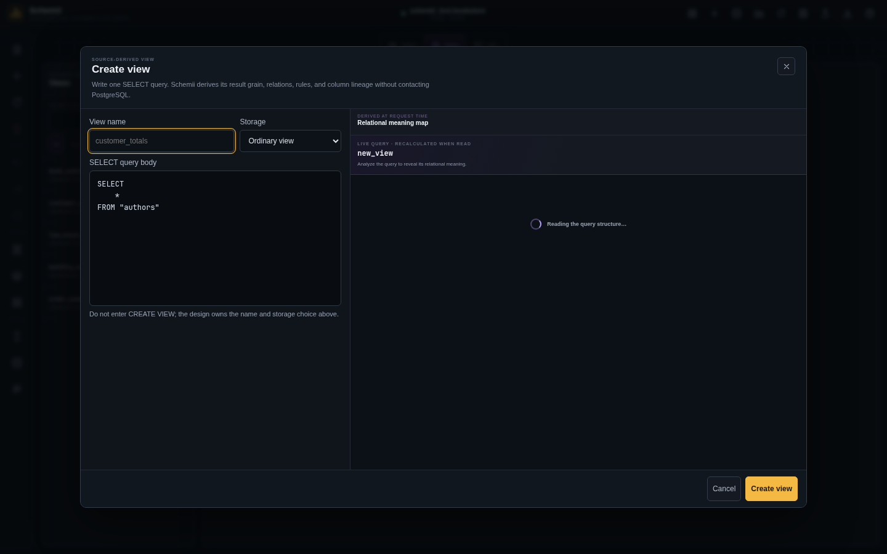

## desktop signin error

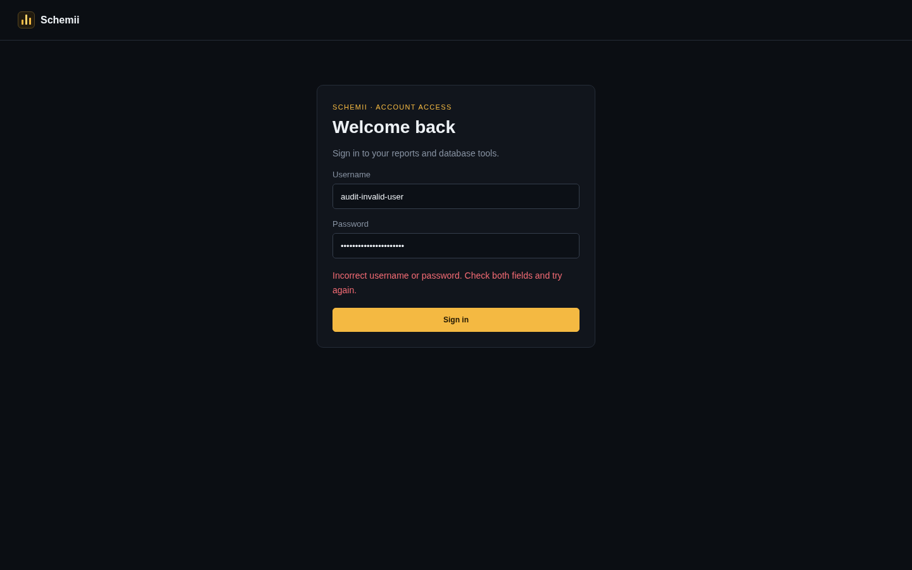

## desktop tall model

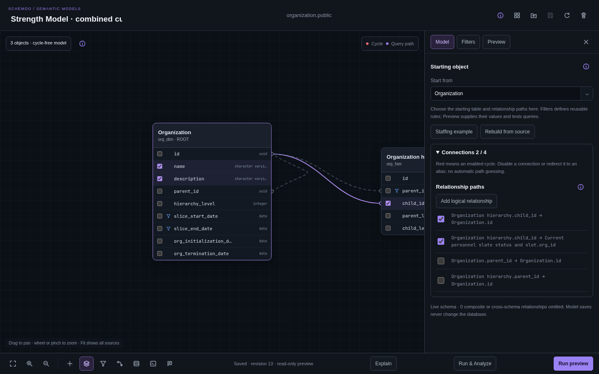

## mobile account menu

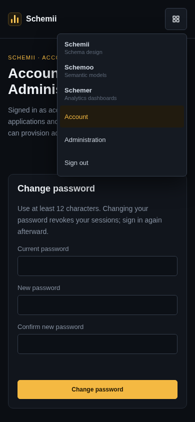

## mobile account

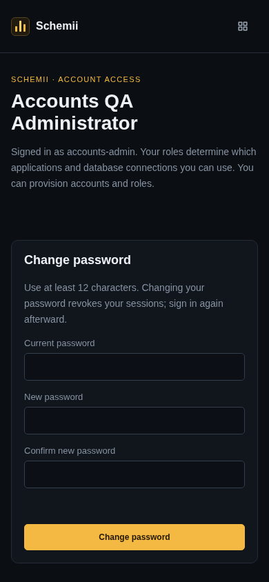

## mobile admin menu

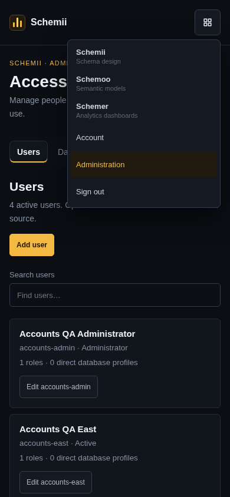

## mobile connection

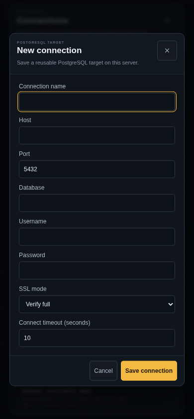

## mobile new table

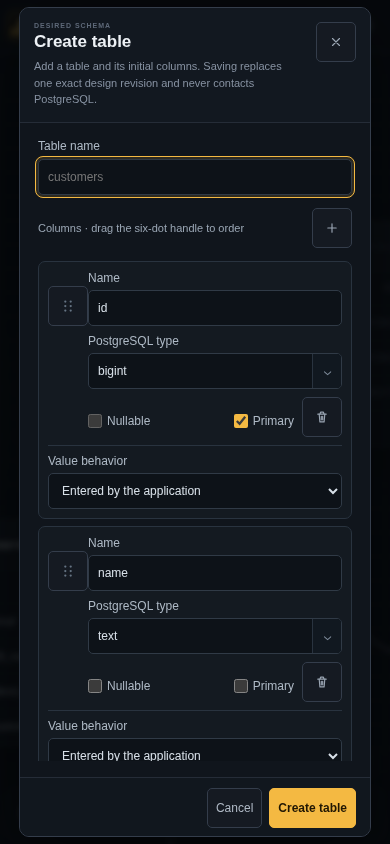

## mobile signin error

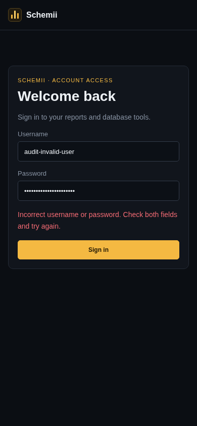

## mobile tall model

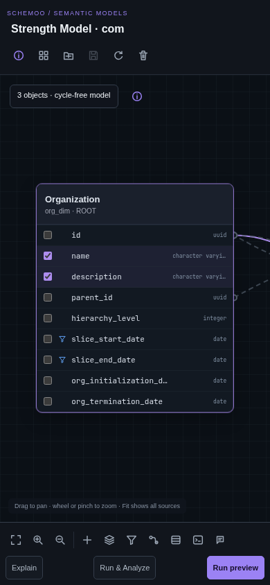

## model desktop clean

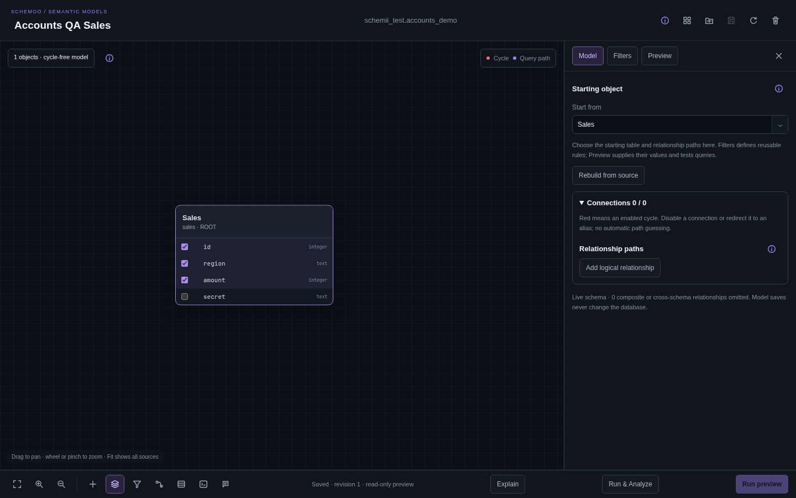

## model desktop derived validation

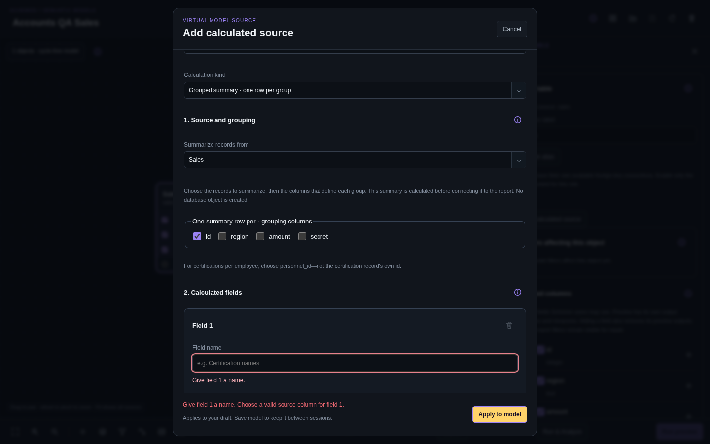

## model desktop filter validation

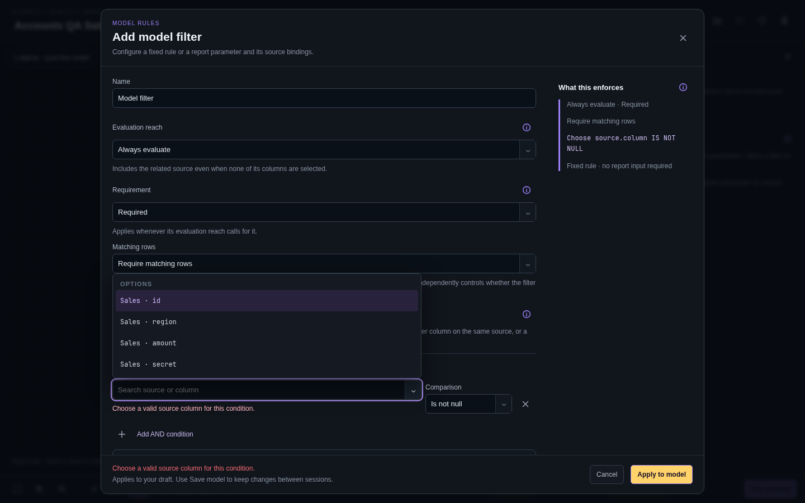

## model mobile clean

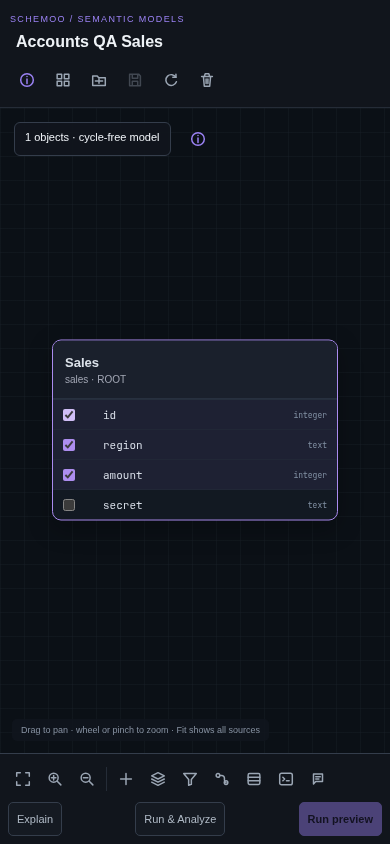

## model mobile derived validation

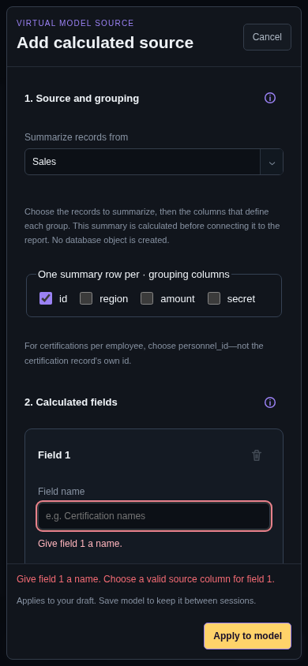

## model mobile filter validation

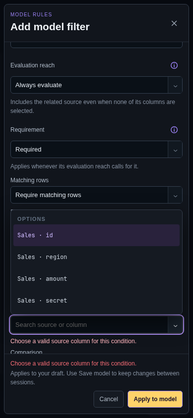

## narrow map populated

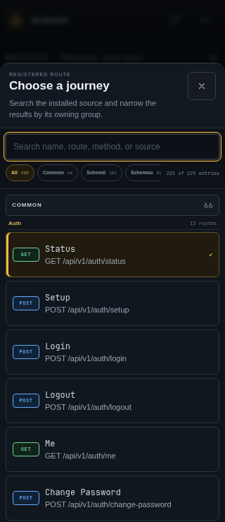

## narrow ordinary view

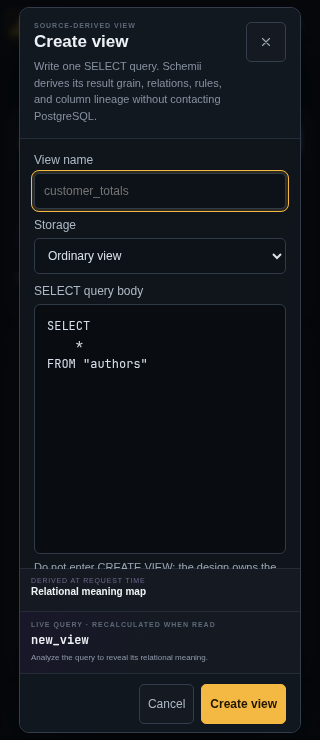

## schemer select desktop

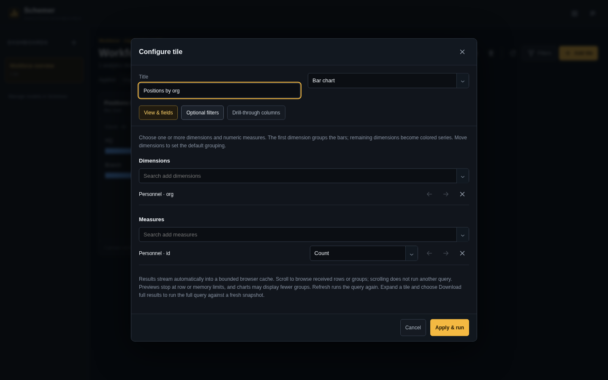

## schemer select mobile

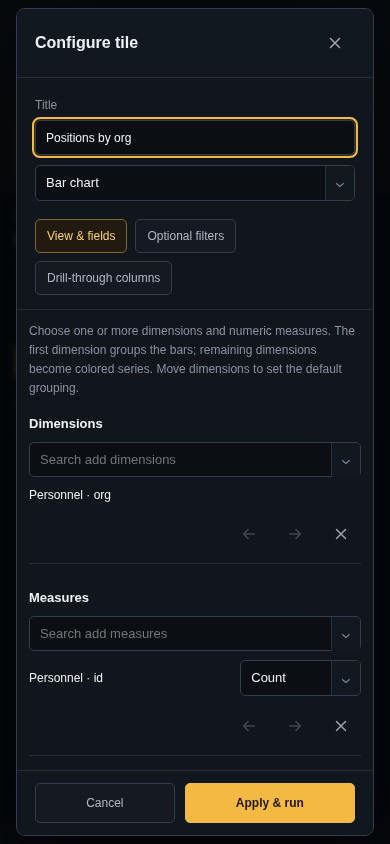
