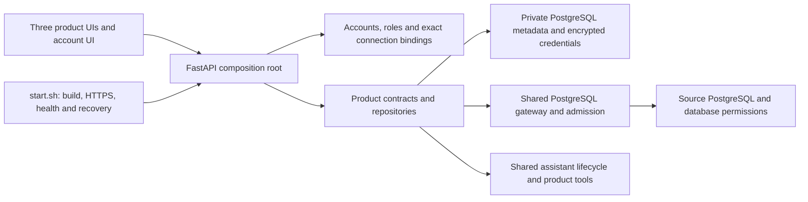

# Project audit and improvement baseline

**Date:** September 29, 2026

**Application:** Schemii / Schemoo / Schemer

**Code-review baseline:** `9a7800a23bd2623ddb73b7cb5ded1c0b9a270657`

**Purpose:** a prioritized, evidence-backed starting point for improvements, including developer workflow and repository housekeeping.

## Assessment

The project has a capable, increasingly well-defined architecture and substantial regression coverage. Its strongest boundaries are PostgreSQL permission enforcement, durable configuration, reviewed migrations, independent model/layout revisions, bounded report caches, and launcher-owned deployment/recovery. Preserve those boundaries and the established visual language.

The most useful next investment is a focused reliability and usability pass. Fix actual lifecycle and memory-budget gaps, protect unsaved work, make failures distinguishable from empty/missing data, and finish the report correctness workflows already in the backlog. The evidence does not justify another ground-up rewrite: the September 28 experiment failed the user's capability/visual expectations and was explicitly discarded. Improve one ownership boundary at a time, with a measurable before/after scenario.

Four immediate priorities stand out:

1. Expire abandoned raw SQL sessions independently of browser requests, and enforce result-memory limits before client-side materialization.
2. Protect SQL-object editor drafts and assistant input from silent loss.
3. Bring the 30 Python QA/provisioning regressions into the normal CI command and make authenticated live tests portable.
4. Repair dashboard/model incompatibilities atomically and explain the snapshot relationship between a report, its drill-through, and a fresh export.

No critical exploit or confirmed permanent loss of an existing saved dashboard was established. This is a broad engineering audit, not a penetration test or proof that every path is defect-free. The report separates reproduced defects, source-confirmed defects, design/capacity gaps, and unverified candidates.

## Scope, method, and evidence

- Reviewed the composition root, shared authentication/connections/metadata/PostgreSQL services, schema editing/query/migration lifecycles, semantic model/compiler contracts, dashboard execution/cache/viewer, shared AI UI, account UI, tests, CI, launcher, recovery documentation, and QA harness.
- Read all 23 open issue bodies at audit start, all 55 available PR records, recent closed issues/review context, and the latest 100 workflow runs. Counts are a dated inventory, not a permanent description of the repository.
- Indexed the project's 48 historical T3 Code chats: 1,158 user messages and 4,887 assistant messages, excluding this audit chat and reasoning messages. Reviewed recurring requests and failure/recovery conversations. Private chat evidence is referenced by title/date/thread ID below; raw transcripts, passwords, session files, and personal database contents are not included.
- Ran the full default Python suite, Node frontend/harness suite, and the additional Python tests under `testing/`. Reviewed the latest hosted CI for the three pending fixes and independently reviewed each diff.
- Rebuilt only through `./start.sh` and checked both canonical local HTTPS and the tailnet HTTPS origin. Browser inspection used T3's native preview. Sign-in, workspace/model libraries, and a real saved dashboard were inspected without saving product changes. DOM measurements and event dispatch provided limited interaction evidence where the preview's screenshot/keyboard tools failed.
- Existing issue screenshots under [`docs/qa/2026-09-26`](../qa/2026-09-26/README.md) were reviewed as historical evidence. Those images do not prove that a current fix failed.

**Evidence labels:** “reproduced” means an explicit local check observed the behavior; “source-confirmed” means the current implementation directly exposes the failure path; “design gap” means a missing policy/workflow/ceiling is established, but an outage or user failure was not induced; “candidate” needs a targeted browser or database reproduction before implementation.

Source locations below refer to the baseline unless an individual PR head is named. Stable links use that commit so future edits do not silently change the evidence.

## Architecture and design

### Boundaries to preserve

- **Configuration is durable; query rows are transient.** Models, dashboards, workspaces and credentials belong in private metadata. Publication, ETL, materialization, scheduling, and persisted result packages are separate capabilities rather than accidental consequences of a report refresh.
- **PostgreSQL remains the data authority.** Product rights and exact managed profile bindings are checked independently from database row/column privileges. Shared AI settings cannot grant report edit/export/drill rights.
- **Migrations have a real execution protocol.** Target identity, design revision/fingerprint, preconditions, transaction boundaries, expected catalog verification, durable commit evidence, and recovery are present. Uncertain commits do not silently retry SQL.
- **Model definition, layout, and Explore state have distinct revisions.** Keep that separation when repairing save/drag/draft behavior.
- **A dashboard refresh shares a consistent source snapshot and browser cache.** Per-query and browser-wide budgets, cancellation, partial-result notices, and fresh full exports already exist. The remaining gaps concern resource enforcement and how users understand the different reads.
- **The supported deployment is one application process.** Source admission, raw sessions, and retained results are process-local; bulk recovery assumes one runtime. Document that assumption before increasing worker count. Horizontal scaling is not an immediate requirement.

### Design gaps already worth deciding

| Boundary | Missing decision or capability | Recommended direction |
| --- | --- | --- |
| Dashboard/model evolution | Repair all incompatible tile/filter bindings as one reviewed change | Validate on the server, preview a repair mapping, save with expected dashboard and model revisions; [#2](https://github.com/LandMineDevelopment/schemii/issues/2) |
| Report trust | Relationship between cached aggregate, fresh drill, and fresh export | Disclose snapshot/time explicitly first; choose retained-snapshot guarantees only if required; [#5](https://github.com/LandMineDevelopment/schemii/issues/5) |
| Large catalog authoring | Models currently start from bounded full-source imports | Let users choose a bounded source subset before creation; [#6](https://github.com/LandMineDevelopment/schemii/issues/6) |
| PostgreSQL compatibility | Opaque objects, materialized views, qualified/composite identities | Provide a compatibility receipt, then add specific safe support; keep blockers for unsupported objects; [#10](https://github.com/LandMineDevelopment/schemii/issues/10), [#11](https://github.com/LandMineDevelopment/schemii/issues/11) |
| Cross-product workflow | Switcher routes lose schema/model task context | Add explicit contextual actions alongside generic navigation; [#8](https://github.com/LandMineDevelopment/schemii/issues/8) |
| Capacity | Source limits are clearer than raw-session, metadata, auth, and design-history budgets | Finish those concrete ownership boundaries before adding pools, workers, or alternative databases |

## Prioritized finding register

P1 means address in the next reliability tranche; P2 means the next focused product/platform tranche; P3 means planned polish or maintenance. Effort is relative: S is a bounded local change, M spans a service/UI lifecycle, L requires a product contract and several consumers. These are planning estimates, not delivery promises.

| ID | Priority | Finding | Evidence | Effort | Tracking |
| --- | --- | --- | --- | --- | --- |
| A01 | P1 | Abandoned raw SQL sessions have no scheduled expiry | Source-confirmed lifecycle defect | M | New |
| A02 | P1 | Managed SQL buffers results before enforcing memory caps | Source + official driver semantics | M | New |
| A03 | P1 | SQL-object editor drafts can be silently discarded | Source-confirmed | M | #15 |
| A04 | P1 | CI omits 30 Python provisioning/cleanup regressions | Discovery + explicit execution | S | New / related #73 |
| A05 | P2 | Metadata query/lock/admission work lacks runtime ceilings | Design/capacity gap | M | New |
| A06 | P2 | Expected account errors lose their recovery guidance | Reproduced in isolated in-memory app | S–M | New |
| A07 | P2 | Login throttling/global auth state lacks bounded scaling | Source-confirmed capacity gap | M | New |
| A08 | P2 | A new assistant draft is erased after an earlier submit | Source-confirmed race | S–M | New |
| A09 | P2 | Schemer product menu misses shared behavior | Source + native preview DOM reproduction | S | New |
| A10 | P2 | Streaming rerenders can destroy keyboard focus | Source-confirmed risk; browser reproduction needed | M | New |
| A11 | P2 | Product first-load errors have weak recovery states | Source-confirmed gap | M | New |
| A12 | P2 | Small status/help text has weak contrast | CSS calculation + live footer measurement | S | New / adjacent closed #50 |
| A13 | P2 | Product CSS overrides shared mobile hitbox sizing | Source-confirmed inconsistency | S | New / related #80 |
| A14 | P2 | Incompatible dashboard upgrades lack atomic repair | Source-confirmed design gap | L | #2 |
| A15 | P2 | Drill-through snapshot meaning is unclear | Current implementation + product contract | M | #5 |
| A16 | P2 | Opt-in SQL live tests cannot authenticate/port cleanly | Source-confirmed test contract defect | M | New |
| A17 | P2 | Main's CI/review checks are advisory | GitHub protection/ruleset inspection | S + policy | New |
| A18 | P2 | QA harness has remaining end-to-end acceptance gaps | Runbook, CLI, issue acceptance | M | #73 |
| A19 | P3 | Declared Python minimum disagrees with imports | Source-confirmed packaging defect | S | New |
| A20 | P3 | Developer test bootstrap is undocumented | README/tooling inspection | S | New |
| A21 | P3 | Tile-editor tabs lack their keyboard/focus contract | Source-confirmed | S–M | New |
| A22 | P3 | Entry-point composition and quality coverage remain uneven | Maintainability gap | Incremental | Related resolved refactors |
| A23 | P3 | Design/history capacity needs a coherent byte budget | Capacity candidate; characterize first | M | New |
| A24 | P2 | Deleted saved objects have no product recovery path | Current hard-delete contracts + historical loss incident | M–L | New |

### A01 — Expire raw SQL sessions without another client request

The raw session service advertises a 1,800-second idle lifetime and returns an expiry timestamp. Its `reap()` is called by subsequent raw-session actions, but not by application lifespan maintenance. The raw database session intentionally does not add its own application idle timeout. A closed browser can therefore leave a manual transaction, locks, and an admission slot alive beyond the advertised expiry. A database role's own timeout may shorten the lock lifetime, but does not clean the application's stale capacity state.

**Evidence:** [`raw_session.py`](https://github.com/LandMineDevelopment/schemii/blob/9a7800a23bd2623ddb73b7cb5ded1c0b9a270657/src/schemii/schemii/console/raw_session.py#L444), lines 27, 143, 182, 209–210, 374, 444–451; `main.py:395–439`; `common/postgres/console/raw.py:22–27`; `common/postgres/gateway.py:1088–1090`. `tests/test_raw_console.py:196–208` invokes the reaper directly, so it does not prove scheduled expiry.

**Remedy/owner:** the console session service and application lifespan should own a bounded periodic sweep, startup/shutdown cleanup, and race-safe exclusion of active operations. Reuse the existing locking/reap boundary.

**Acceptance:** leave an uncommitted lock in an owned test schema, close every client, advance beyond expiry, and verify rollback, capacity release and state removal without another HTTP request. Cover concurrent touch, running work, grant revocation, and idempotent shutdown. No live lock-abandonment experiment was performed during this audit.

### A02 — Enforce memory budgets before materializing SQL results

Managed multi-statement/write execution creates an ordinary unnamed Psycopg cursor and calls `execute()` before counting bytes in `fetchmany(100)`. Psycopg's ordinary cursor buffers the complete result client-side; fetching in batches does not make that transport incremental. A large SELECT or DML `RETURNING` can exhaust the container before the configured preview error is reached. Bulk batches share this executor. Ordinary retained read paging uses named cursors, but a batch of very wide rows can still exceed its byte budget before conversion.

**Evidence:** [`console/gateway.py:483`](https://github.com/LandMineDevelopment/schemii/blob/9a7800a23bd2623ddb73b7cb5ded1c0b9a270657/src/schemii/common/postgres/console/gateway.py#L483), lines 407–414, 483–514 and 245–269; `common/postgres/gateway.py:693–698`; `schemii/bulk_jobs/service.py:276–281`. [Psycopg client-side cursor documentation](https://www.psycopg.org/psycopg3/docs/advanced/cursors.html#client-side-cursors) confirms the driver behavior. Raw execution already uses single-row mode (`common/postgres/console/raw.py:58–61`).

**Remedy/owner:** shared PostgreSQL execution should use incremental transport for unbounded returning rows, including write results, with cancellation and rollback. Select named cursors only where legal, and preserve statement/transaction semantics. Raising the container limit or wrapping arbitrary SQL in `LIMIT` does not fix ownership.

**Acceptance:** real PostgreSQL SELECT, wide-row, DML RETURNING, and multi-statement tests exceed the configured result budget while measured peak process memory remains bounded; failure rolls back/releases capacity and a subsequent normal query succeeds. A fake cursor unit test cannot establish the memory property. This audit did not stress the live database/container.

### A03 — Protect unsaved SQL-object editor drafts

View/type/routine/trigger editors reload saved text when opened, and their close paths clear editor state. Close buttons and native Escape have no dirty veto. Browser unload protection covers table drafts and open Console transactions only. A long SQL definition can disappear on Escape, close, refresh, or navigation.

**Evidence:** [`design-editors.js:103`](https://github.com/LandMineDevelopment/schemii/blob/9a7800a23bd2623ddb73b7cb5ded1c0b9a270657/src/schemii/schemii/web/assets/design-editors.js#L103), also line 564; `schemii/web/assets/app.js:4700–4702,4992–4995`. Existing [#15](https://github.com/LandMineDevelopment/schemii/issues/15) remains valid after editor extraction PRs #112/#114.

**Remedy/owner:** the existing design-editor controller should own per-object draft snapshots, a dirty predicate, and one close/discard decision. Decide explicitly whether drafts survive browser refresh; at minimum prevent silent discard.

**Acceptance:** each editor's close/Escape/navigation path warns; declining preserves text/focus; successful save clears dirty state; unchanged forms do not warn; validation/conflict retains the draft. Use behavioral browser tests rather than source-string assertions.

### A04 — Collect the omitted Python QA tests in CI

`pytest` discovers `tests/` only. Five Python regression files under `testing/` are omitted from the default and integration CI commands, while npm covers only JavaScript harness tests. Those files cover report-author provisioning, sweep/preseed/follow-up generation, cleanup ownership, and redaction—the same setup/cleanup boundaries that repeatedly caused development friction.

**Evidence:** [`pyproject.toml:48`](https://github.com/LandMineDevelopment/schemii/blob/9a7800a23bd2623ddb73b7cb5ded1c0b9a270657/pyproject.toml#L48); `.github/workflows/ci.yml:46,83`; `testing/test_report_author_fixtures.py`; `testing/harness/test_schemii_{cleanup,followup,preseed,sweep}.py`.

**Observed:** `.venv/bin/python -m pytest -q testing` passed **30 tests**. This is independent evidence, not inclusion in the existing default CI run.

**Remedy/owner:** test configuration/CI should add `testing` to discovery or run it explicitly, and document the canonical command. Verify that its mocked/temp-directory tests remain safe in fresh and retained environments.

**Acceptance:** a clean CI run collects all 30 alongside current tests; a deliberately failing test under `testing/` fails that job; no live account/data mutation is introduced by collection.

### A05 — Bound normal metadata operations

Normal metadata connections configure connection timeout but no statement/lock ceiling, and are outside source admission. Readiness has a separate two-second deadline. Auth mutation uses a global advisory lock without a wait deadline, while ordinary authenticated requests also open metadata connections. A blocker can stall control-plane requests indefinitely, and a burst can consume metadata sessions independently of source limits.

**Evidence:** [`common/metadata/database.py:92`](https://github.com/LandMineDevelopment/schemii/blob/9a7800a23bd2623ddb73b7cb5ded1c0b9a270657/src/schemii/common/metadata/database.py#L92), lines 92–113; `common/metadata/factory.py:129,135–139`; `common/auth/store.py:25–27`; `common/auth/middleware.py:74–77`.

**Remedy/owner:** metadata factory/transaction boundaries need runtime statement/lock deadlines and bounded admission, with safe retryable outage/capacity errors. Give startup migrations separate allowances. Add a focused pool only if it solves measured churn, rather than introducing a generic framework.

**Acceptance:** an owned integration lock blocker causes bounded completion and safe recovery; concurrent metadata requests remain under a declared session ceiling; readiness/control paths remain usable. This is a verified missing ceiling, not an induced production outage.

### A06 — Preserve safe account validation and recovery messages

Expected last-admin, role-validation, and current-password errors are raised as `HTTPException`, whose useful details are replaced with “The request could not be completed.” Authentication middleware also returns `{detail: ...}` while the shared browser client reads the structured `error` envelope. Users cannot tell which input or constraint to correct.

**Evidence:** [`common/api/errors.py:147`](https://github.com/LandMineDevelopment/schemii/blob/9a7800a23bd2623ddb73b7cb5ded1c0b9a270657/src/schemii/common/api/errors.py#L147); `common/auth/service.py:60–64,248–250`; `common/auth/routes.py:144`; `common/auth/middleware.py:69,75,79`; `common/web/assets/http.js:65–71`.

**Observed:** an isolated in-memory app returned generic text for final-admin disable (409) and incorrect current password (403). No real account was changed.

**Remedy/acceptance:** use typed safe business errors and one shared envelope factory, while retaining generic handling for unexpected internal details. Assert meaningful codes/messages for final admin, bad current password, duplicate/invalid grants, expired auth and revoked access; verify secret-free unexpected failures.

### A07 — Bound auth CPU/state and avoid whole-state login transactions

The attempt throttle is per submitted username, including nonexistent names. Varying those names bypasses that limit. Auth transactions read all account/session/role/grant/attempt state; writes deepcopy it and serialize on a global lock. Failed login performs several such transactions and password hashing. Sessions and authentication audit lack clear cardinality/retention ceilings.

**Evidence:** [`common/auth/service.py:207`](https://github.com/LandMineDevelopment/schemii/blob/9a7800a23bd2623ddb73b7cb5ded1c0b9a270657/src/schemii/common/auth/service.py#L207), lines 207–232; `common/auth/store.py:30–46,95–96`; metadata migration `0037_accounts_roles.sql:43–54`.

**Remedy/owner:** source/global hash admission and bounded attempt/session/audit policies; targeted SQL for login/session operations; reserve the global lock for invariants that require it. Tailnet ingress narrows exposure but does not bound a noisy client's resource use.

**Acceptance:** diverse nonexistent usernames cannot evade aggregate admission; legitimate login remains available; hashing concurrency is bounded; login work stays nearly constant as unrelated state grows; revocation/final-admin invariants and retention remain correct. This is a capacity finding, not an authentication bypass.

### A08 — Keep the next assistant message draft

The shared Schemoo/Schemer composer captures submitted text, awaits chat creation/message POST, then clears the textarea. The input remains editable during that await. Text typed for the next message is therefore erased when the earlier request completes; first-chat creation has the same window. Schemii already clears its submitted draft before awaiting.

**Evidence:** [`model-assistant.js:297`](https://github.com/LandMineDevelopment/schemii/blob/9a7800a23bd2623ddb73b7cb5ded1c0b9a270657/src/schemii/common/web/assets/model-assistant.js#L297), lines 113, 258, 297–308; `schemii/web/assets/ai-assistant.js:989`.

**Remedy/acceptance:** clear only the accepted submitted draft synchronously; chat creation must not clear a newer draft. Delay both requests, type a second draft, and prove it survives success/failure. Recover the failed original message without replacing new input. Cover IME and one-pending-submit behavior. No paid/provider turn was executed for this finding.

### A09 — Make application navigation own its menu lifecycle

Schemer calls `initializeUi()` before installing product navigation. Common UI snapshots the menus present at initialization, so that new menu misses Escape/outside-click/reposition listeners. Other products initialize in the opposite order; accounts install a controller explicitly.

**Evidence:** [`studio.js:493`](https://github.com/LandMineDevelopment/schemii/blob/9a7800a23bd2623ddb73b7cb5ded1c0b9a270657/src/schemii/schemer/web/studio.js#L493); `common/web/assets/ui.js:566`; `product-navigation.js:15`; `tests/e2e/product-navigation.spec.js:3` covers Schemoo only.

**Observed:** native preview DOM checks opened the Schemer menu and dispatched bubbling Escape/outside-click events; the menu stayed open. Native keyboard/screenshot tooling was unreliable, so this is a DOM reproduction plus source evidence, not a complete physical-keyboard/mobile acceptance pass.

**Remedy/acceptance:** navigation installation should register its own menu controller, or all products must install it before initialization, without duplicate listeners. Test all five product/account/admin routes at 320/390/1280px: Escape restores trigger focus, outside click closes, one menu opens at once, resizing keeps links visible, and capability filtering remains intact.

### A10 — Preserve keyboard focus while report batches arrive

Incoming frames schedule complete main/drill/footer rerenders. Scroll position is restored, but focused controls, cells, and marks are recreated. Charts replace metric/group selectors. Virtual tables also make every cell a sequential tab stop. This can interrupt keyboard/screen-reader use during a stream.

**Evidence:** [`result-viewer.js:56`](https://github.com/LandMineDevelopment/schemii/blob/9a7800a23bd2623ddb73b7cb5ded1c0b9a270657/src/schemii/schemer/web/result-viewer.js#L56), lines 56–86; `result-cache.js:35`; `visualizations.js:39`; `scroll-results.js:20–21`.

**Remedy/acceptance:** stable action controls, keyed data updates/focus restoration, and a roving grid navigation model. During delayed detail/bar/time streams, focused cells/selects/drill marks/export controls must survive batches; Tab reaches the footer efficiently; virtual scrolling preserves logical selection and names. Browser reproduction is required before calling any specific screen-reader behavior confirmed.

### A11 — Distinguish loading, error, empty, and ready states

Schemer's first-load catch writes a notice without Retry; a failed library can leave an author-facing welcome resembling a genuine empty account. Schemoo's failed library shows only a paragraph, and a failed model open can make an uninitialized workbench non-inert. Account UI already has a useful unavailable/Try again pattern.

**Evidence:** [`studio.js:494`](https://github.com/LandMineDevelopment/schemii/blob/9a7800a23bd2623ddb73b7cb5ded1c0b9a270657/src/schemii/schemer/web/studio.js#L494), lines 494–503; `schemoo/web/model-library.js:141`; `prototype.js:789`; `common/web/assets/accounts.js:303`.

**Observed adjacent detail:** after the Schemoo model library finished loading successfully, the no-model background still said “Loading relationships…”. That false busy label also appears in the September 26 harness validation notes. Treat it as an empty-state correction within this boundary.

**Remedy/acceptance:** explicit bootstrap states and visible Retry; preserve prior successful context on recoverable refresh failures; keep authoring inert until ready. Fail each account/library/model/catalog request independently and recover without full reload or null-state errors. Preserve Schemer's existing saved-title/tile-count fallback on context failure (`studio.js:400`), and improve error classification/recovery so users do not infer deletion.

### A12–A13 — Improve readability and phone hitboxes without changing the style

`--faint: #5d6878` on `--panel: #11151c` has approximately **3.24:1** contrast. Schemer uses it for 10px cache/completion footers; those exact size/color values were measured in the running dashboard. Shared assistant help is approximately 4.01:1 at 11px against its actual `#0d1218` background, and its composer hint about 3.35:1 at 8px. The existing `--muted` color gives about 5.81:1 on the panel. Essential state/instruction text needs a readable semantic token; faint styling can remain for nonessential decoration.

Shared mobile icon controls are 40×40px, but Schemoo overrides them to 34×34px and some toolbar widths to 30px. Schemer's more-actions summary is explicitly 25×28px; its edit/SQL buttons retain the inherited 40×40px mobile dimensions despite smaller declared minimums. The inconsistent targets merit touch inspection, not an automatic blanket accessibility violation: spacing/target exceptions require rendered-layout inspection.

**Evidence:** [`ui.css:13`](https://github.com/LandMineDevelopment/schemii/blob/9a7800a23bd2623ddb73b7cb5ded1c0b9a270657/src/schemii/common/web/assets/ui.css#L13), also 102, 176; `schemer/web/studio.css:27–28`; `model-assistant.css:34,40`; `schemoo/web/prototype.css:39,138`.

**Acceptance:** essential normal-size text reaches 4.5:1 on actual backgrounds; 200% text scaling retains readable state/current values; phone hitboxes/spacing are consistent at 320/390px without overflow. Keep compact glyphs and the dark/subdued visual language. Include [#80](https://github.com/LandMineDevelopment/schemii/issues/80)'s model/reasoning/permission truncation and the software keyboard in the same pass. Current mobile screenshot verification was blocked by native preview tooling.

### A14–A15 — Finish report evolution and trust workflows

The implemented compatible model update is useful, but `studio.js:334–359` keeps old tile configuration while updating revision and filtering selections. There is no complete field/filter repair mapping for incompatible changes. A stale dashboard can remain unable to validate/run. Separately, drill-through starts a fresh stream (`studio.js:100`) and full export executes a fresh query; these are not necessarily the snapshot that produced the cached aggregate.

**Evidence:** [`studio.js:334`](https://github.com/LandMineDevelopment/schemii/blob/9a7800a23bd2623ddb73b7cb5ded1c0b9a270657/src/schemii/schemer/web/studio.js#L334); `result-viewer.js:66–68`; existing [#2](https://github.com/LandMineDevelopment/schemii/issues/2), [#5](https://github.com/LandMineDevelopment/schemii/issues/5). `schemer-dashboards.spec.js:95` tests a compatible update.

**Acceptance:** server-owned validation/repair receipt; removed fields/scopes, changed types, new required inputs and multiple invalid tiles repair in one revision-checked save; cancel/failure keeps the original. Main/drill/export show meaningful execution timestamps and completeness/snapshot language. Test source changes between aggregate and drill; decide whether fresh investigation is acceptable before designing persisted snapshots.

### A16 — Repair authenticated live-test setup

The opt-in semantic SQL helper sends JSON and Origin but no session cookie/login. Its first protected workspace request cannot work against the authenticated canonical deployment. It also assumes preexisting machine-specific workspaces. Time-analysis live tests reuse it. Default skipping hides the broken contract.

**Evidence:** [`test_schemoo_sql_live.py:26`](https://github.com/LandMineDevelopment/schemii/blob/9a7800a23bd2623ddb73b7cb5ded1c0b9a270657/tests/test_schemoo_sql_live.py#L26), lines 26–37; `test_schemer_time_sql_live.py:17,24–27`; `common/auth/middleware.py:74–75`.

**Remedy/acceptance:** private credential-file convention, authenticated owned test account, portable seeded targets, cleanup receipts, and a deliberate launcher-backed job. No auth bypass. A fresh environment must run the opted-in tests successfully with explicit prerequisites, and cleanup must leave unrelated objects untouched. These suites were not opted in here.

### A17–A18 — Make acceptance durable and enforceable

GitHub's main protection endpoint reports “Branch not protected” and the ruleset list is empty. CI is substantial, but a direct push or merge with incomplete/cancelled checks can pass policy. This is consistent with a historical cancelled-CI merge later exposing an inspection regression; that regression is now fixed and must not be counted as current.

The harness correctly separates sessions, evidence, functional/visual results, blocked prerequisites, and process completion. Remaining [#73](https://github.com/LandMineDevelopment/schemii/issues/73) work includes broad concurrent writes/chat/paging/recovery acceptance and final checks. Suite execution/verification-slot reservation is a runbook responsibility, not a completed controller guarantee. Interrupted provisioning can safely refuse an unledgered collision but still require manual recovery.

**Evidence:** GitHub main protection/rulesets GET results; [`testing/harness/README.md`](../../testing/harness/README.md); `testing/harness/cli.mjs:74,79–96`; [harness validation](../../testing/harness/VALIDATION.md).

**Remedy/acceptance:** propose required CI checks/no destructive history operations and decide review requirements separately; do not silently change repository policy during an audit. Complete one portable report-author acceptance path, then writer/chat lanes, with owned fixtures and an independent verifier. Persist ownership intent/operation IDs before remote mutation where crash recovery needs them. The report is a baseline for that work, not a claim it is complete.

### A19–A23 — Keep installation, maintenance, and capacity contracts honest

- **A19, Python minimum:** `pyproject.toml:11` allows 3.10 while `common/admin_config.py:8` unconditionally imports `tomllib` (3.11+); CI/runtime use 3.12. Align the supported app minimum or add a verified compatibility import/dependency. Test clean installation/import at the declared minimum; recovery script requirements are a separate contract.
- **A20, developer setup:** README's test commands start with `.venv/bin/python` without creating/installing that environment; npm/Node prerequisites are missing from the developer path. Document Python 3.12 venv, constrained editable dev/quality install, Node/npm install, optional browser install, canonical launcher, and private test auth.
- **A21, tabs:** `schemer/web/tile-editor.js:31,75,81` declares ARIA tabs but recreates triggers, lacks roving tabindex/Arrow/Home/End, and lacks complete panel naming. Stable tabs should preserve focus and implement their declared keyboard contract.
- **A22, composition/quality:** `app.js` remains about 5,048 lines; `prototype.js` and `studio.js` mix several lifecycles in dense code. Incremental Python quality covers two type seeds and limited legacy checks; JS has no formatting/lint command. Source-substring tests verify static contracts but cannot prove interaction ordering/focus/drafts. Extract/format a boundary as its behavior changes, expand useful ratchets, and retain buildless delivery. File size alone is not a rewrite rationale.
- **A23, design/history budget:** desired design count/per-expression limits permit large full documents and up to 100 retained snapshots, without a coherent aggregate byte budget. Ingress does cap requests at 20 MiB, so inbound size is not unlimited; export validation has a separate 16 MiB ceiling. Characterize a realistic large design and establish compatible save/history/export budgets before claiming a reproduced failure. Evidence: `designs/models.py:18,439–444,630`, `designs/postgres_store.py:143–145,177–205`, `dev/ingress/nginx.conf:22`.

### A24 — Provide a scoped recovery path for deleted saved work

Historical chat evidence records an accidental saved-model deletion on September 13, followed by restoration from an older conversation snapshot with a new identity and loss of the latest layout/preview/edit state. Current product deletion remains permanent: models, dashboards and workspaces are directly deleted; associated preview/design/history rows cascade. There is no product trash/restore route or model version-history facility. This is a current design gap supported by a real historical loss incident, not a claim that this audit deleted anything.

**Evidence:** `schemoo/store.py:432–441`; `schemoo/metadata/migrations/0031_saved_model_previews.sql:12`; `schemoo/README.md:14–18`; `schemoo/web/model-deletion.js:18`; `schemer/dashboard_store.py:163–168`; `schemii/workspaces/postgres_store.py:633–648`; Schemii metadata `0007_design_history.sql:20–22,36–38,52–54`.

Dependency protections are already present: models block deletion while dashboards depend on them, and active workspace migrations block deletion. Keep those safeguards and treat recoverability as separate. Instance backup/restore is also useful but does not provide a practical single-object Undo.

**Remedy/acceptance:** decide a small owner-visible trash/restore window and explicit purge policy before implementation. Restoration should preserve the original identity, definition, layout, preview configuration and references; retain current ownership/grant enforcement. Test accidental delete/restore, concurrent edits, name/identity conflicts, dependency behavior, expired retention and explicit purge. Do not restore source database rows or resurrect removed permissions implicitly. A broad version-history system is not required to first solve recoverable deletion.

## T3 Code chat findings: recurring development issues

The chat archive is useful evidence about repeated friction, not an alternate source of current repository truth. Older authorization, feature requests, cancelled experiments, and fixed bugs were not automatically treated as instructions to change this task's scope.

Keyword counts below are overlapping **triage indicators**, not incident counts: testing/setup appears in 27 threads/136 user messages; branch/delivery/cleanup in 24/89; saved-state/drift in 17/61; runtime/deployment in 13/52; UI interaction/clarity in 11/73; analytical terms in 18/62. A message can belong to several groups, and words can be incidental. Conclusions use the concrete conversations and current code evidence.

| Theme | Concrete evidence | Current interpretation | Improvement |
| --- | --- | --- | --- |
| Runtime knowledge had to be corrected repeatedly | “Checking commits before pushing in t3code” (`9ef37283…`), Aug 30–31: repeated Docker socket/sudo corrections and request for one startup script | The launcher contract now resolves that process boundary; #113/#115 repaired primary-worktree secret ownership | Make the launcher/build identity and effective non-secret config easy to inspect; test worktree deployment and source-access preflight, preserve sole-launcher rule |
| Test setup required user intervention | “Test Schemii UI With Agent Harness” (`35c9f2d6…`), Sep 26–27: credentials/provider, existing accounts, ten lanes, writable fixtures, exact types and cleanup had to be spelled out | Isolation/provisioning improvements are delivered, but missing test discovery and #73 acceptance remain | One documented prerequisites/fixtures matrix, exact owned mission fixtures, deliberate independent verifier and automatic test collection |
| A limited probe was mistaken for broad capability coverage | Same harness chat; “Codebase Cleanup Audit” (`0a801d5e…`), Sep 27 | The harness now preserves blocked/failed outcomes; full feature acceptance is still distinct | A feature × persona × viewport × success/error/recovery coverage ledger with evidence and untouched gaps |
| Source failure looked like missing saved data | “Restore Missing Schemer Dashboards” (`ec951d1c…`), Sep 29: saved dashboard remained intact but source-host policy returned 403; relaunch applied existing host config | Access recovered; no deletion established. Existing saved-title/count fallback should be preserved | Improve source/access/config error classification and visible Retry; include source-access health beyond generic readiness |
| Actual accidental deletion had no usable Undo | “Improve Query Execution and Paging” (`9e191766…`), Sep 13, 12:57–12:59 UTC: saved model restored from an older chat snapshot with a new identity | Current hard deletes confirm a recoverability gap; dependency protection alone is not recovery | Scoped retention/restore/purge contract for owned saved objects; A24 |
| Dirty state and asynchronous redraws recur | “Deep Copy Models” (`917fe263…`); “Validate App Start Guides” (`e7894921…`), Sep 24; admin/model QA Sep 26 | Several stale-model, canonical-default, canvas pointer/save races were fixed. A03/A08/A10 are current adjacent seams | Test delay/ordering/close/focus combinations at the state owner, not only source strings or happy-path saves |
| Tutorial pictures drifted from executable workflows | “Checking commits…” Aug 26; “Validate App Start Guides”, Sep 24 | Sequence/seed/label/reduced-motion fixes have merged | Treat each guide as an executable scenario using portable seed data; compare current scene labels and prerequisites when changing workflows |
| Long chats and temporary branches accumulated handoff state | “Deep Copy Models”; “Organize Repository and Review Issues” (`9741c85b…`), Sep 28–29; “Find Easy Issue Wins” (`2c45834f…`), Sep 29 | Prior cleanup was valid at its date; the next task legitimately created new worktrees | One task branch/PR, native links, current-head evidence, scoped commits, private artifact preservation, and a final branch/worktree inventory |
| Rewrite ambition lacked a capability contract | “Rebuild App on a New Branch” (`53353793…`), Sep 28: user requested same/improved capability/look, rejected incomplete result, then requested restoration | Experiment cancelled; no renewed rewrite authorization in this audit | Use explicit parity criteria and comparative acceptance before architecture replacement; target confirmed boundaries first |
| T3/provider failures interrupted work | Some sessions record OpenCode status/abort errors, missing provider auth, usage limits, and preview automation failures | Tool/platform incidents, not automatically Schemii defects | Record exact failure and verification gap; resume from saved state; keep platform recovery separate from app bug fixes |

### Durable development changes suggested by the history

1. Add a short developer bootstrap and a prerequisites table: product role, target profile, schema baseline, AI availability, write authorization, owned prefix, result/page expectations, cleanup, and independent verification.
2. Store acceptance in repository tests and reviewed reports rather than relying on a long chat's final “passed.” Always identify the exact source/PR head and distinguish functional, visual, and blocked results.
3. Keep source-access diagnostics separate from application liveness. A healthy API can still have a blocked saved connection or stale effective config.
4. Use one composition/state owner for local drafts, async save/load, pointer capture, and streaming focus. Include delay/ordering tests when touching these boundaries.
5. Finish PR delivery before cleaning worktrees, preserve private evidence, and verify native chat links. Background PRs mentioned in history should not be linked to unrelated chats.

### Accepted product requirements to preserve

Earlier conversations contain experiments that were superseded by later decisions. Four accepted contracts are particularly relevant to these fixes:

- Human raw SQL follows PostgreSQL permissions, explicit auto-commit preferences and visible transaction state. The September 12 query discussion intentionally rejected restrictive SQL rewriting and hidden transaction wrapping. Raw statement-timeout absence is deliberate; advertised idle-session cleanup and bounded transport still need to work.
- Preview rows belong to one execution stream, are bounded by rows/bytes, and release source capacity at completion/cap. Fresh full export remains distinct. Separate LIMIT/OFFSET queries were rejected after pagination consistency concerns; do not reintroduce them as a performance shortcut.
- Personal AI credential retention follows actual user activity with an explicit enable/disable policy. Background polling/token refresh must not extend idle retention, and a late callback must not resurrect expired credentials. These are preservation/regression requirements, not newly confirmed defects.
- Tutorials and common controls must reflect real mounted workflows. Alternative data engines and thousand-user scale discussions are roadmap research, not current supported promises or authorization to add services during cleanup.

## Existing backlog, reconciled

Do not create new issues duplicating this table. Existing issues #41 and #73 have updated September 28 status; old unchecked sections must be read together with those updates.

| Issue | Remaining scope | Suggested sequence |
| --- | --- | --- |
| [#2](https://github.com/LandMineDevelopment/schemii/issues/2) | Atomic incompatible dashboard repair | Next correctness tranche; A14 |
| [#5](https://github.com/LandMineDevelopment/schemii/issues/5) | Explicit drill snapshot contract/time | Decide alongside report trust; A15 |
| [#6](https://github.com/LandMineDevelopment/schemii/issues/6) | Select source subsets for large schemas | Before raising import limits |
| [#7](https://github.com/LandMineDevelopment/schemii/issues/7) | Restrict cycle rejection to participating query graph | Compiler behavior change; structural #109 is not completion |
| [#8](https://github.com/LandMineDevelopment/schemii/issues/8) | Contextual cross-product handoffs | Small scoped workflow actions |
| [#9](https://github.com/LandMineDevelopment/schemii/issues/9) | Reviewed detached design deployment | Preserve original design and explicit target identity |
| [#10](https://github.com/LandMineDevelopment/schemii/issues/10) | Opaque objects/materialized-view migration compatibility | Split disclosure from specific support |
| [#11](https://github.com/LandMineDevelopment/schemii/issues/11) | Cross-schema/composite-key relationships | Qualified identities through UI, compiler, permissions and drift |
| [#12](https://github.com/LandMineDevelopment/schemii/issues/12) | Filter/compose calculated outputs | Coordinate with #14/#27, preserve grain semantics |
| [#13](https://github.com/LandMineDevelopment/schemii/issues/13) | Fair initial tile delivery and preview capacity | Measure latency; preserve budgets/snapshot/cancellation |
| [#14](https://github.com/LandMineDevelopment/schemii/issues/14) | Sorting/top-N/postaggregation filters | High user value; a preview limit is not semantic top-N |
| [#15](https://github.com/LandMineDevelopment/schemii/issues/15) | Protect SQL-object drafts | Immediate; A03 |
| [#26](https://github.com/LandMineDevelopment/schemii/issues/26) | Pivots/subtotals/grand totals | Reporting roadmap, not a regression |
| [#27](https://github.com/LandMineDevelopment/schemii/issues/27) | Calculated report measures/KPI targets | Reporting roadmap after correctness |
| [#28](https://github.com/LandMineDevelopment/schemii/issues/28) | Business number/conditional formatting | Presentation tranche |
| [#29](https://github.com/LandMineDevelopment/schemii/issues/29) | Reproducible packages/scheduled delivery | Requires explicit persisted-data/operations design |
| [#41](https://github.com/LandMineDevelopment/schemii/issues/41) | Managed write profiles, role-shared schema/model resources, final acceptance | Product capabilities/exact bindings/private resources already delivered; split residual scope |
| [#73](https://github.com/LandMineDevelopment/schemii/issues/73) | Full repeatable agent UI acceptance/recovery | Infrastructure partially delivered; A18 |
| [#77](https://github.com/LandMineDevelopment/schemii/issues/77) | Desired view browser's zero-column count disagrees with inspector | Small correctness fix at shared output-shape owner |
| [#80](https://github.com/LandMineDevelopment/schemii/issues/80) | Mobile AI current model/reasoning/permissions truncation | Shared mobile clarity pass |

At audit start, #76/#78/#79 were also open and already had ready PRs. They are delivery work, not new findings; their final disposition is recorded below. The other 20 issues remain the improvement backlog after those fixes.

All initial open issues lacked an assignee, and readiness/priority/product often lived in bodies or chats. Use a small queryable label/owner scheme (`ready`, `needs design`, `in review`, product and priority) and a next-step owner. Do not inflate the backlog with duplicate architectural issues.

### Historical problems already resolved

- #48–#55, #92, #105: multiple account/nav/type/select/canvas/focus/validation/login/title defects were fixed. Current adjacent concerns need fresh evidence.
- #65–#68: first-model chat, canvas overlap, requested validation fields and pagination cursor retention were fixed by #69–#72.
- #82/#19: actual AI auth/dependency/capability documentation corrected in #98.
- #84–#89: named phases, scoped dependencies, grants/identifiers/routes, and editor extraction landed in #102/#103/#106/#108/#109/#112/#114.
- #90: incremental Python quality delivered in #101; it is limited, not absent.
- #93/#113: launcher tests isolated retained QA state and primary-worktree secret ownership fixed in #94/#115.
- #96: runtime inspection regression fixed in #100. Older PR text describing that failure does not override current green head checks.
- #99/#104: report-author fixture/profile and harness stream-order fixes delivered in #107/#116; broader #73 remains open.
- #25: time analysis delivered through #32–#34. #35 multidimensional tiles delivered in #36; neither supplies #26 pivots. #16/#37 were superseded filter-collapse requests closed through #38.

The latest 100 workflow runs included 46 successes, 20 failures and 34 cancellations. This is **not a flake rate**: known shared baseline defects and deliberate cancel-in-progress/merge-train cancellations explain part of the sample. Judge current exact-head results, then classify any repeat failure before changing tests or adding retries.

## Improvement plan and acceptance gates

| Tranche | Work | Exit gate |
| --- | --- | --- |
| 1 — Reliability and saved work | A01/A02/A03/A04; A08; useful account errors A06 | Real database expiry/memory tests; all draft close/send delay cases; all QA regressions in CI; no silent rollback/retry or input loss |
| 2 — Trust and recovery | A05/A07; A11/A24; #2/#5; #77 | Bounded metadata/auth failure; saved-object/source-state distinction and Retry; recoverable saved-object deletion; atomic repair; snapshot/completeness disclosure |
| 3 — Shared UI detail | A09/A10/A12/A13/A21; #80 | Product-menu matrix, streaming keyboard focus, readable contrast, phone hitboxes/current values, 200% text, software keyboard, proper tabs |
| 4 — Durable development | A16/A17/A18/A19/A20/A22 | Clean-machine test bootstrap, declared Python minimum, authenticated portable fixtures, required checks policy, evidence/cleanup/recovery acceptance |
| 5 — Reporting and source capabilities | #6–#14, #26–#29, residual #41 | Explicit feature contracts, qualified identities/grain/sorting tests, permissions and drift safety, measured resource cost |

Suggested commits/PRs should remain focused: session lifecycle; SQL materialization; SQL editor drafts; test discovery; assistant draft handling; navigation lifecycle; dashboard repair; snapshot disclosure. A shared UI pass can group coherent tokens/hitboxes but should not pull in unrelated report features.

Every acceptance report should identify commit, persona/grant, exact owned fixture, viewport/browser, expected result, observed result, evidence, and cleanup receipt. A blocked precondition stays blocked, and worker/process completion is not an application pass.

## Verification, delivery, and repository cleanup

### Checks performed

| Check | Result / scope |
| --- | --- |
| Default Python suite at audit baseline | **1,557 passed, 71 skipped**; 241.08 seconds |
| Additional Python QA/provisioning suite | **30 passed**; these are currently omitted from default discovery |
| Node frontend + harness suite | **395 passed**, no failures/skips |
| Independent #118 review | 8 focused migration tests, clean diff, all 7 hosted checks passed at `22e7133` |
| Independent #119 review | 15 focused Console/workspace/navigation tests, syntax/diff check, all 7 hosted checks passed at `94b5683` |
| #120 review | 8 migration tests, syntax/diff/discovery checks; strengthened real Show/Hide visibility and Enter/focus regression; **all 7 hosted checks passed at `c115ac0`** |
| Canonical launcher and HTTPS | Baseline `./start.sh` succeeded; local and tailnet root returned 200; Tailscale Serve configuration inspected without reset |
| Native browser inspection | Signed in; workspace/model library readback; Test strength 1 returned both tiles, one bounded at 10,000 groups; menu DOM reproduction; 10px/faint footer measurement |
| Combined-main verification at `399733c` | `./start.sh` and both HTTPS roots passed; **395 Node tests** and **30 additional Python tests** passed again; focused browser run **5/6 passed**, then the failed desktop case **1/1 passed** in isolation |

The initial combined-main desktop disabled-Apply case timed out before workspace initialization: its toolbar remained disabled and the trace showed several module fetches without completed responses. The corresponding Android case and the other four cases passed; the isolated desktop recheck passed in 2.3 seconds. The cause of that one startup/load stall is **unresolved**. No application retry, timeout increase, test skip, or automatic retry was added to conceal it. If it repeats, investigate asset transport/startup with the same trace evidence before declaring an app or test defect. Initial and recheck logs are retained privately.

**Verification limits:** default skips include integration/opt-in live coverage; no new live memory stress, abandoned-transaction experiment, production access mutation, paid AI turn, destructive data operation, full manual persona sweep, Safari/Firefox pass, physical phone pass, or screen-reader acceptance was performed. Native preview screenshot, resize and key operations failed after an initial login screenshot; current visual/mobile assertions therefore rely on source evidence and hosted browser tests where indicated. No manual UI acceptance pass is inferred from those tool failures or a DOM probe.

### Delivery and cleanup record

The user authorized completing and merging ready PRs #118–#120 during this audit. Each was independently reviewed and natively linked to this T3 chat before completion. #120 received a focused test improvement rather than accepting an assertion that could pass while both hidden labels existed in the DOM.

- [PR #118](https://github.com/LandMineDevelopment/schemii/pull/118): disabled migration Apply styling; merged as `247e117`.
- [PR #119](https://github.com/LandMineDevelopment/schemii/pull/119): detached Console loading/prerequisite visibility; merged as `d802f8b`.
- [PR #120](https://github.com/LandMineDevelopment/schemii/pull/120): mobile migration SQL and stronger disclosure test; all seven final-head checks passed; merged as `399733c`.

Housekeeping is performed only after exact merge/ancestry verification and clean tracked/untracked status. The five commits on `qa/easy-wins-combined` have exact stable-patch equivalents on the pushed fix branches; that temporary combined tree holds no unique committed feature work. Private ignored evidence is archived before removal. No user metadata, source data, secrets, T3 database contents, saved chat associations, or unrelated routes are discarded.

All four preexisting auxiliary worktrees and their local branches were removed after merged ancestry or exact patch-equivalence verification. The three merged remote fix branches were deleted and refs/worktree metadata pruned. **125 private ignored files** were archived under `.schemii/worktree-archives/audit-cleanup-20260929/` with private directory/file permissions and content/hash verification. No saved T3 worktree association or live process used those paths, and the deployment lease was free. The only remaining temporary worktree at report assembly is this report's own task branch, which is removed after its delivery.

Native `list_thread_pull_requests` verified #118/#119/#120 as linked and merged. Issues #76/#78/#79 are closed; **20 existing issues remain open**. All new findings in this report remain proposed improvement work; no duplicate issues or unrelated implementation changes were silently created. Final report delivery is identified by its PR and chat link, and final housekeeping is verified again before handoff.
